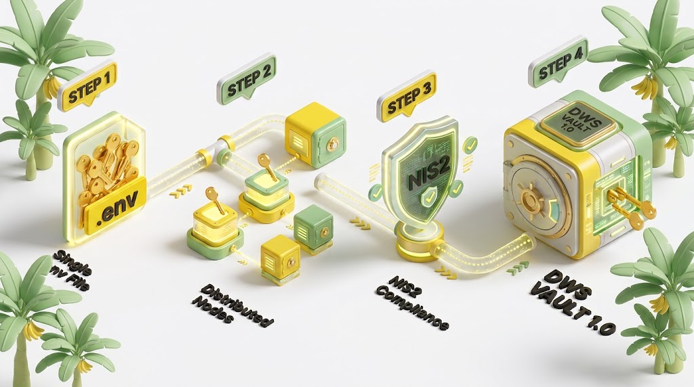
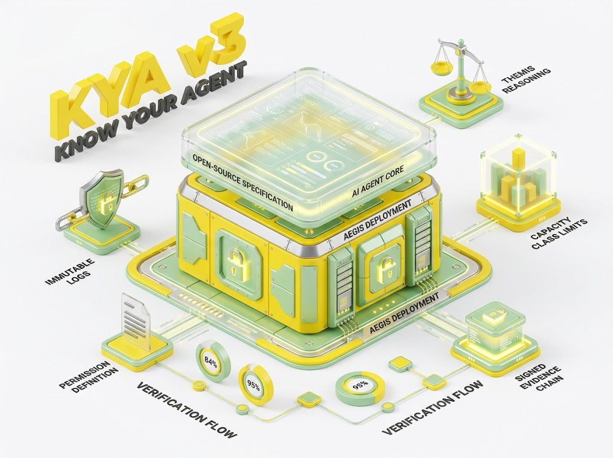

# DWS Vault V1 — Secrets Custody for Agent Production Environments

_Click the image for the full-size version (2000 px)._

Open principles. Proprietary implementation.

DWS Vault is how Lifetime Oy keeps the secrets of an agent production environment: database
passwords, API keys, signing keys and the credentials a customer entrusts to a connector. The
principles are public so that anyone can check what a vault that follows them must do. How DWS
Vault does it — the code, the schema, the deployment and the evidence it produces — is not.

**Kenellä on avaimet, kuka niitä luki, ja saako ne takaisin?**
→ **DWS Vault V1 -periaatteet** kertovat, mitä hyvältä avainten säilytykseltä vaaditaan.
→ **DWS IQ** toteuttaa ne asiakkaan omalla raudalla.

## What's open (Apache-2.0)

- The principles (`principles/PRINCIPLES.md`): what a secrets store for agents must guarantee
- Conformance checks (`conformance/CONFORMANCE.md`): testable statements a deployment passes or fails
- The NIS2 Art. 21(2) mapping (`docs/NIS2_MAPPING.md`): which measure each principle supports

## What's proprietary (Lifetime Oy)

- The DWS Vault implementation: command-line tool, audit parser, database schema, deployment scripts
- The audit evidence a deployment produces, and the way it is chained and kept off the host
- The integration with DWS IQ Workflow v2 and KYA v3 (how an agent resolves a secret without seeing it)

## Limitations of the open principles

Principles say what must hold. They do not show that a given deployment holds it. A vault that
publishes its principles but not its evidence can only be trusted as far as its operator lets
itself be checked. That is why the conformance checks are written to be run against a live
deployment, on the customer's own hardware, with the results kept outside the reach of whoever
operates the vault.

## Why open principles

A customer, an auditor or a supplier assessor must be able to ask the same questions of any
vault: who holds the keys, who read them, who changed them, and can they be restored — by the
right person only. Publishing the principles makes those questions standard. Answering them for
a specific deployment is the implementation's job, under the agreement.

## Relation to KYA v3

[KYA v3](https://github.com/blogtheristo/KYA_V3) defines what an agent may do. DWS Vault defines
how the secrets behind those rights are held. An agent below its required trust level resolves
no secret; a secret is never placed in an agent's context.

Both follow the same two-layer model: the open specification on top, the proprietary deployment
and its evidence underneath. DWS Vault is the "secure data vaults" part of that lower layer.

| KYA v3 — two layers                                              | KYA v3 — Know Your Agent                                            |
| ---------------------------------------------------------------- | ------------------------------------------------------------------- |
|  |  |

## Repository layout

| Path                                | Content                                                   |
| ----------------------------------- | --------------------------------------------------------- |
| `principles/PRINCIPLES.md`          | Principles P1–P10                                         |
| `conformance/CONFORMANCE.md`        | Checks C1–C14, each mapped to a principle                 |
| `docs/NIS2_MAPPING.md`              | NIS2 Art. 21(2) measures and the principles behind them   |
| `images/`                           | DWS Vault and KYA v3 illustrations                        |
| `scripts/check-public-boundary.mjs` | CI check that keeps implementation out of this repository |

Contributions to the principles are welcome by pull request. Implementation code is not accepted
here; CI rejects it (`scripts/check-public-boundary.mjs`).

---

**Principles:** https://github.com/blogtheristo/DWS_Vault_V1  
**Implementation:** Provided under your agreement with Lifetime Oy (`IMPLEMENTATION_LICENSE.md`)  
**Security contact:** see `SECURITY.md`

Lifetime Oy · Business ID 0772407-9 · Espoo, Finland
